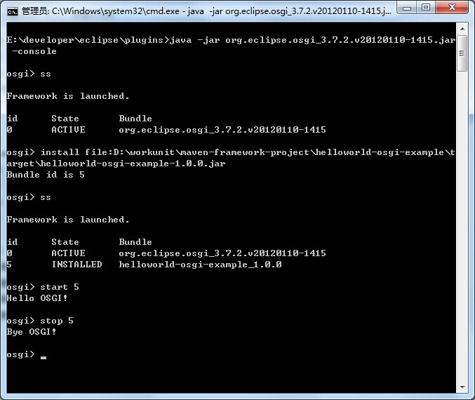

# helloworld-osgi-example

```
mvn install
```



# 参考文章

[http://felix.apache.org/site/apache-felix-maven-bundle-plugin-bnd.html](http://felix.apache.org/site/apache-felix-maven-bundle-plugin-bnd.html)

[https://docs.jboss.org/author/display/AS7/The+helloworld-osgi+example+in+depth](https://docs.jboss.org/author/display/AS7/The+helloworld-osgi+example+in+depth)