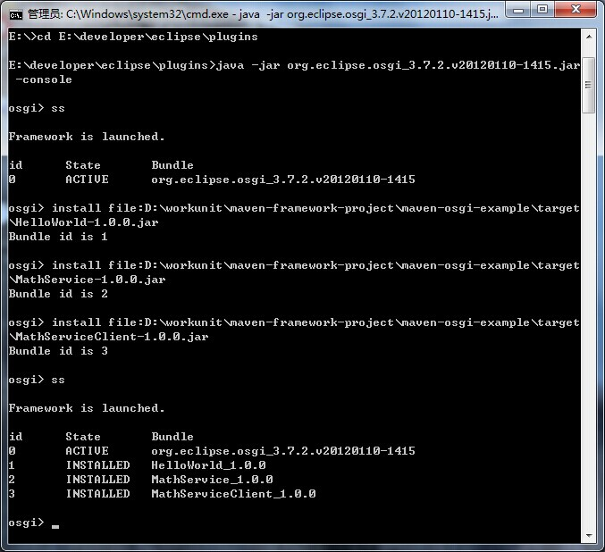
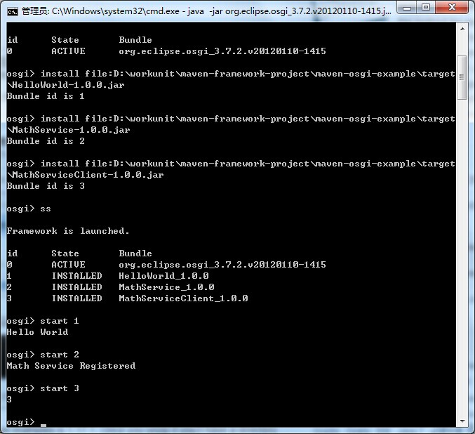
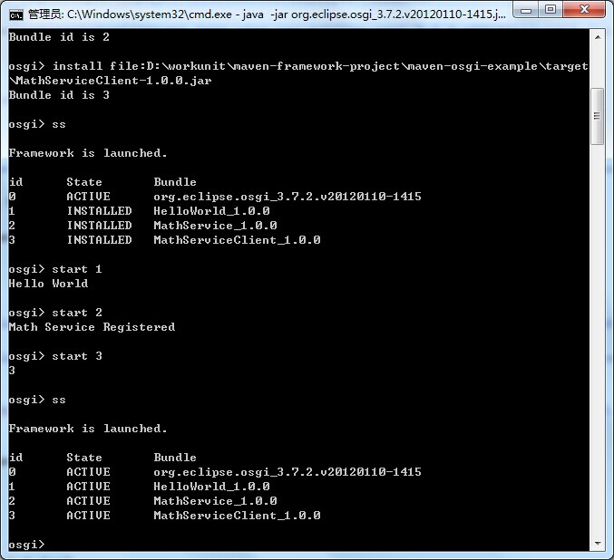

maven-osgi-example
=======================

先执行下面的操作

`mvn clean package`

`mvn -PMathService package`

`mvn -PMathServiceClient package`

Goto  Eclipse Plugin directory in command prompt

这里使用的eclipse环境为3.7

进入`eclipse\plugins`目录  

`cd E:\developer\eclipse\plugins`

执行`java -jar org.eclipse.osgi_3.7.2.v20120110-1415.jar -console`

`E:\developer\eclipse\plugins>type java -jar org.eclipse.osgi_3.7.2.v20120110-1415.jar -console`

或者

`java -jar org.eclipse.osgi_[version].jar -console`

具体为

`E:\developer\eclipse\plugins>java -jar org.eclipse.osgi_3.7.2.v20120110-1415.jar -console`

now type ss to see all services

Sample Commands to install services

安装以下jar包

`install file:D:\workunit\maven-framework-project\maven-osgi-example\target\HelloWorld-1.0.0.jar`

`install file:D:\workunit\maven-framework-project\maven-osgi-example\target\MathService-1.0.0.jar`

`install file:D:\workunit\maven-framework-project\maven-osgi-example\target\MathServiceClient-1.0.0.jar`

Sample Commands to start and stop services

`start 1`

`stop 1`

安装Bundle

启动Bundle

查看状态

[http://www.javacodegeeks.com/2011/06/osgi-using-maven-equinox.html](http://www.javacodegeeks.com/2011/06/osgi-using-maven-equinox.html)