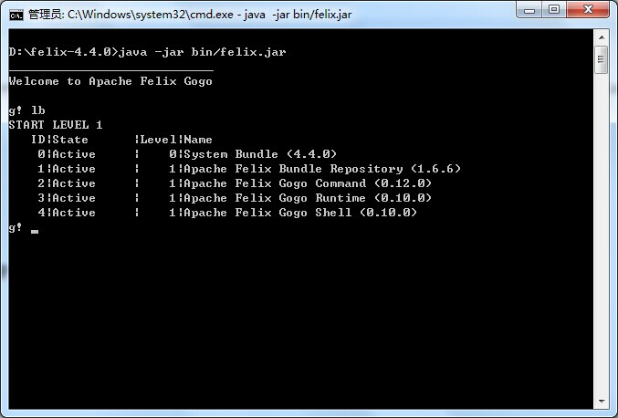
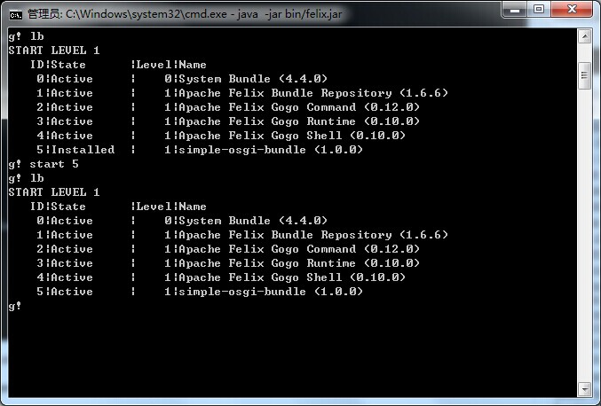
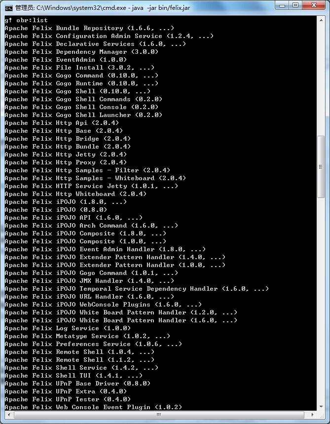
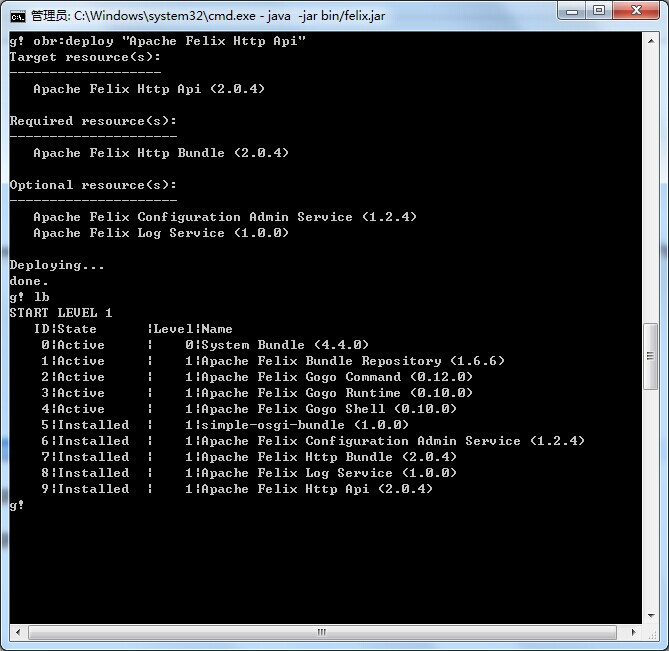
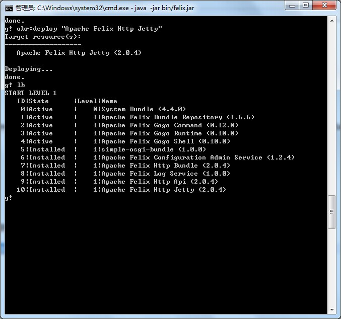
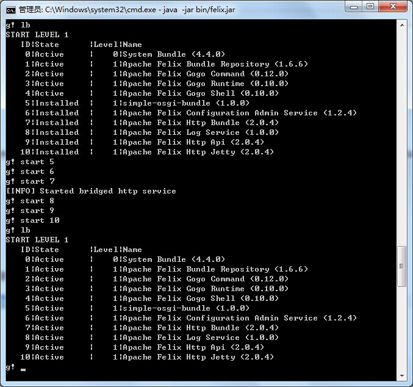

# simple-osgi-bundle

打包、安装

```
mvn package install
```

启动felix

```
java -jar bin/felix.jar
```

安装simple-osgi-bundle

```
install file:/D:/workunit/maven-framework-project/simple-osgi-webapp/simple-osgi-bundle/target/simple-osgi-bundle-1.0.0.jar
```















# 参考文章

[http://felix.apache.org/site/apache-felix-maven-bundle-plugin-bnd.html](http://felix.apache.org/site/apache-felix-maven-bundle-plugin-bnd.html)

[http://www.hascode.com/2010/07/how-to-create-a-simple-osgi-web-application-using-maven/](http://www.hascode.com/2010/07/how-to-create-a-simple-osgi-web-application-using-maven/)