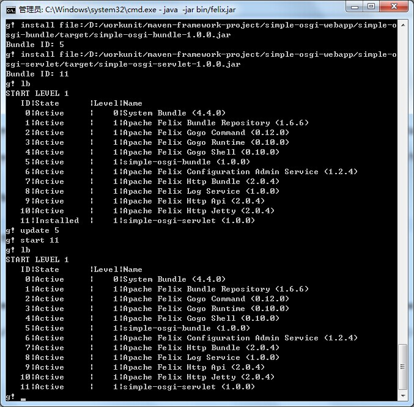
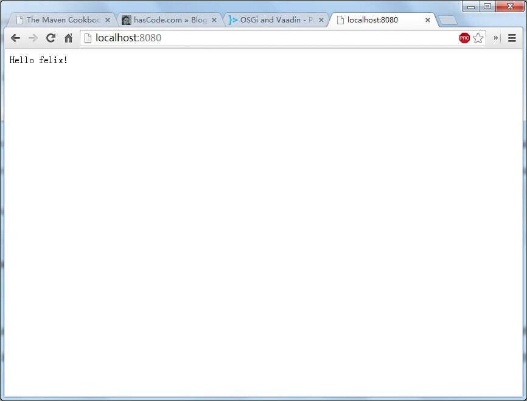
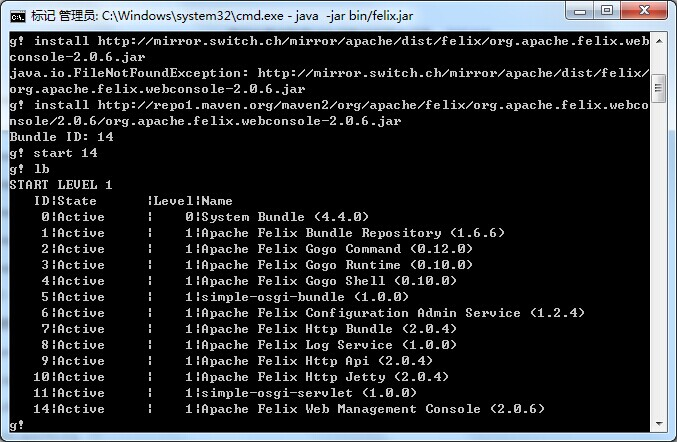
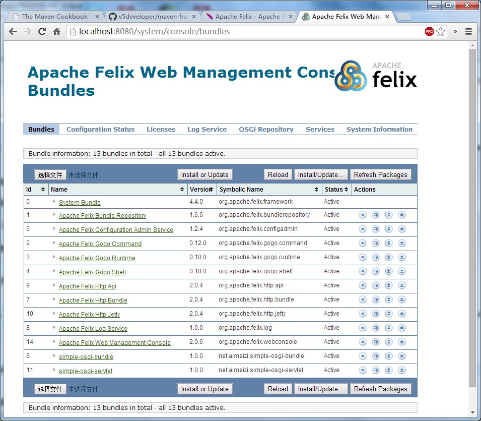
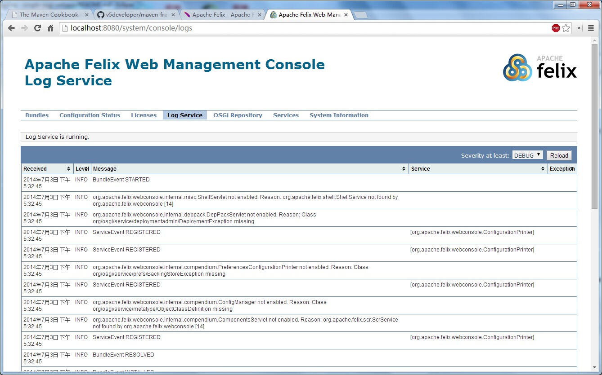
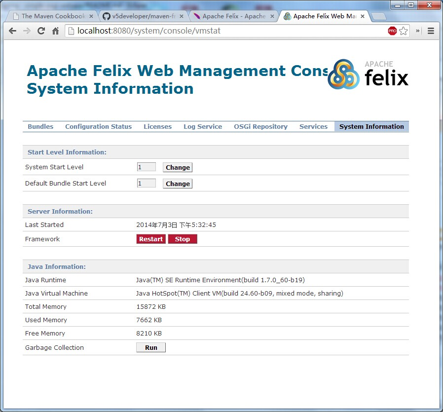

# simple-osgi-servlet

打包、安装

```
mvn package install
```

启动felix

```
java -jar bin/felix.jar
```

安装simple-osgi-bundle

```
install file:/D:/workunit/maven-framework-project/simple-osgi-webapp/simple-osgi-bundle/target/simple-osgi-bundle-1.0.0.jar
```

安装simple-osgi-servlet

```
install file:/D:/workunit/maven-framework-project/simple-osgi-webapp/simple-osgi-servlet/target/simple-osgi-servlet-1.0.0.jar
```




浏览器访问

[http://localhost:8080/](http://localhost:8080/)




安装Apache Felix Web Console

```
install http://repo1.maven.org/maven2/org/apache/felix/org.apache.felix.webconsole/2.0.6/org.apache.felix.webconsole-2.0.6.jar
```

查看Apache Felix Web Console



登录

admin/admin

bundles



logs



System Information




# 参考文章

[http://felix.apache.org/site/apache-felix-maven-bundle-plugin-bnd.html](http://felix.apache.org/site/apache-felix-maven-bundle-plugin-bnd.html)

[http://www.hascode.com/2010/07/how-to-create-a-simple-osgi-web-application-using-maven/](http://www.hascode.com/2010/07/how-to-create-a-simple-osgi-web-application-using-maven/)