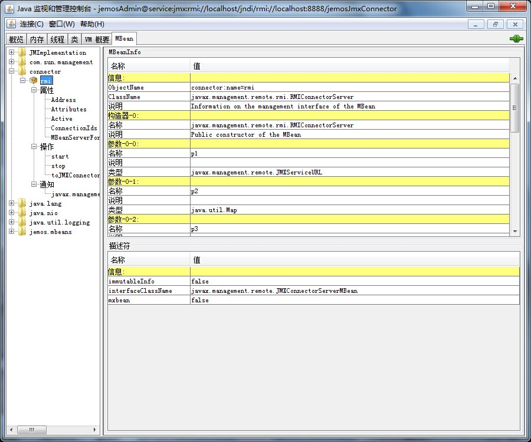
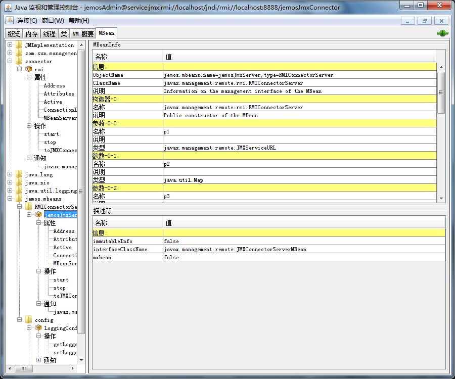

# spring3-jmx-example

copy jmxremote.access jmxremote.password

service:jmx:rmi://localhost/jndi/rmi://localhost:8888/jemosJmxConnector

jemosAdmin / secure

* [http://www.javacodegeeks.com/2012/07/jmx-and-spring-part-1.html](http://www.javacodegeeks.com/2012/07/jmx-and-spring-part-1.html)

* [http://www.javacodegeeks.com/2012/07/jmx-and-spring-part-2.html](http://www.javacodegeeks.com/2012/07/jmx-and-spring-part-2.html)

* [http://www.javacodegeeks.com/2012/07/jmx-and-spring-part-3.html](http://www.javacodegeeks.com/2012/07/jmx-and-spring-part-3.html)