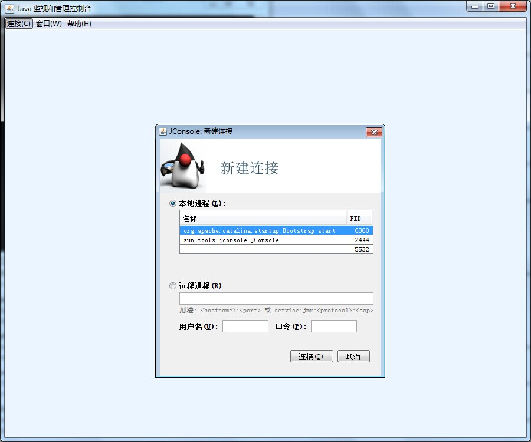
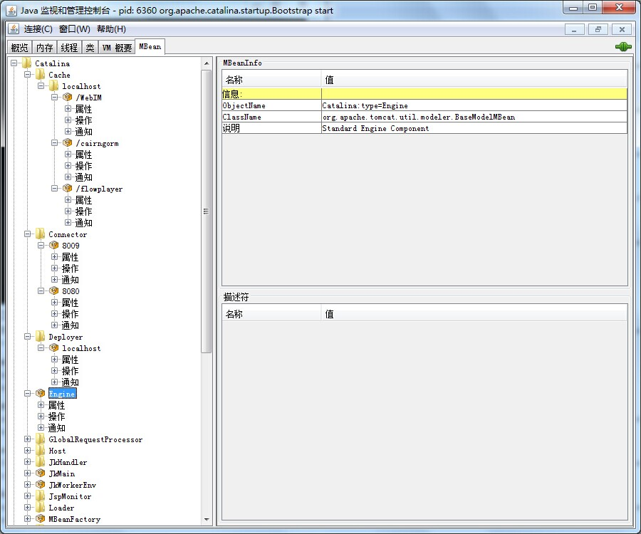
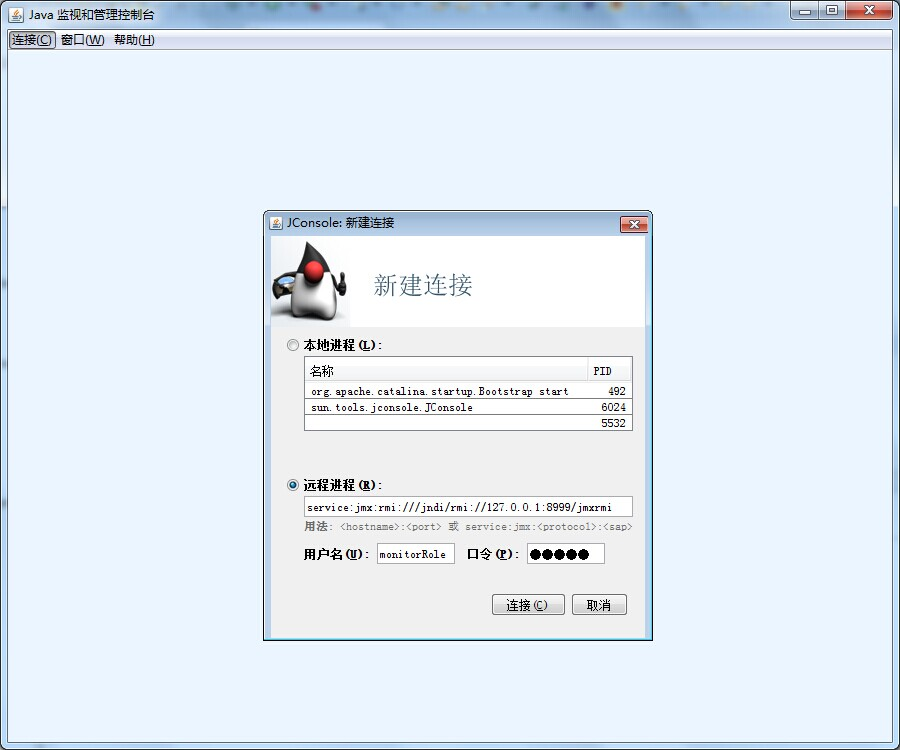
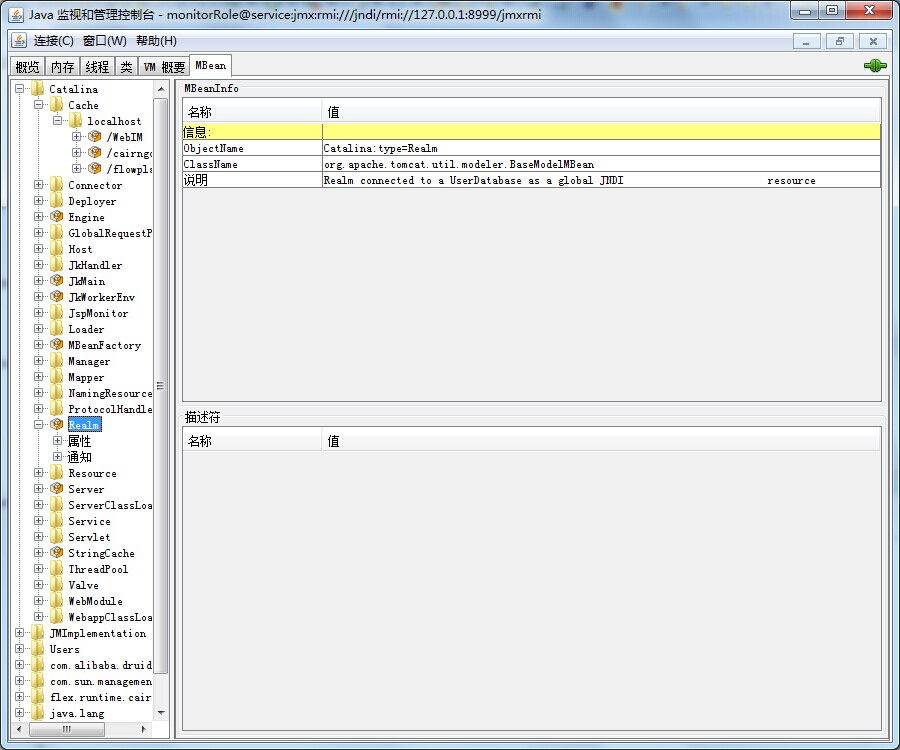

# 使用JMX监控Tomcat

## 1. 激活Tomcat的JMX远程配置

要通过JMX远程监控Tomcat，首先需要激活Tomcat的JMX远程配置。

① 先修改Tomcat的启动脚本，windows下为bin/catalina.bat（linux下为catalina.sh），添加以下内容，8999是jmxremote使用的端口号，第二个false表示不需要鉴权：

```bash
set JMX_REMOTE_CONFIG=-Dcom.sun.management.jmxremote -Dcom.sun.management.jmxremote.port=8999 -Dcom.sun.management.jmxremote.ssl=false -Dcom.sun.management.jmxremote.authenticate=false
set CATALINA_OPTS=%CATALINA_OPTS% %JMX_REMOTE_CONFIG%
```

*要注意以上语句的位置不能太后面，可以加在【if "%OS%" == "Windows_NT" setlocal】一句后的大段的注释后面。*

参考官方说明： 

[http://tomcat.apache.org/tomcat-6.0-doc/monitoring.html#Enabling_JMX_Remote](http://tomcat.apache.org/tomcat-6.0-doc/monitoring.html#Enabling_JMX_Remote)

② 上面的配置是不需要鉴权的，如果需要鉴权则添加的内容为：

```bash
set JMX_REMOTE_CONFIG=-Dcom.sun.management.jmxremote -Dcom.sun.management.jmxremote.port=8999 -Dcom.sun.management.jmxremote.ssl=false -Dcom.sun.management.jmxremote.authenticate=true -Dcom.sun.management.jmxremote.password.file=../conf/jmxremote.password -Dcom.sun.management.jmxremote.access.file=../conf/jmxremote.access
set CATALINA_OPTS=%CATALINA_OPTS% %JMX_REMOTE_CONFIG%
```

③ 然后复制并修改授权文件 

$JAVA_HOME/jre/lib/management下有jmxremote.access和jmxremote.password的模板文件，将两个文件复制到$CATALINA_BASE/conf目录下

◆ 修改$CATALINA_BASE/conf/jmxremote.access 添加内容：
     monitorRole readonly
     controlRole readwrite
     
◆ 修改$CATALINA_BASE/conf/jmxremote.password 添加内容：
     monitorRole admin
     controlRole admin

注意： 如果进行了以上步骤导致Tomcat启动不了，那么很可能是密码文件的权限问题 

需要修改jmxremote.password文件的访问权限，只有运行Tomcat的用户才能拥有访问权限 ： 
      Windows的NTFS文件系统下，选中文件，点右键 -->“属性”-->“安全”--> 点“高级”--> 点“更改权限”--> 去掉“从父项继承....”--> 弹出窗口中选“删除”，这样就删除了所有访问权限。再选“添加”--> “高级”--> “立即查找”，选中你的用户（或用户组，如果选用户不行那就选用户组），例administrator，点“确定"，“确定"。来到权限项目窗口，勾选“完全控制”，点“确定”，OK了。

官方的提示： 
      The password file should be read-only and only accessible by the operating system user Tomcat is running as.

④ 重新启动Tomcat，在Windows命令行输入“netstat -a”查看配置的端口号是否已打开，如果打开，说明上面的配置成功了。
 
⑤ 使用jconsole测试JMX。

运行$JAVA_HOME/bin目录下的jconsole.exe，打开J2SE监视和管理控制台，然后建立连接，如果是本地的Tomcat则直接选择然后点击连接，如果是远程的，则进入远程选项卡，填写地址、端口号、用户名、口令即可连接。。Mbean属性页中给出了相应的数据，Catalina中是tomcat的，java.lang是jvm的。对于加粗的黑体属性值，需双击一下才可看内容。     





使用远程连接查看tomcat





## 2. 使用JMX监控Tomcat示例代码

```java
String jmxURL = "service:jmx:rmi:///jndi/rmi://192.168.10.93:8999/jmxrmi";
JMXServiceURL serviceURL = new JMXServiceURL(jmxURL);

Map map = new HashMap();
// 用户名密码，在jmxremote.password文件中查看
String[] credentials = new String[] { "monitorRole", "admin" };
map.put("jmx.remote.credentials", credentials);
JMXConnector connector = JMXConnectorFactory.connect(serviceURL, map);
MBeanServerConnection mbsc = connector.getMBeanServerConnection();

// 端口最好是动态取得
ObjectName threadObjName = new ObjectName("Catalina:type=ThreadPool,name=http-8080");
MBeanInfo mbInfo = mbsc.getMBeanInfo(threadObjName);

// tomcat的线程数对应的属性值
String attrName = "currentThreadCount";
MBeanAttributeInfo[] mbAttributes = mbInfo.getAttributes();
System.out.println("currentThreadCount:" + mbsc.getAttribute(threadObjName, attrName));
```