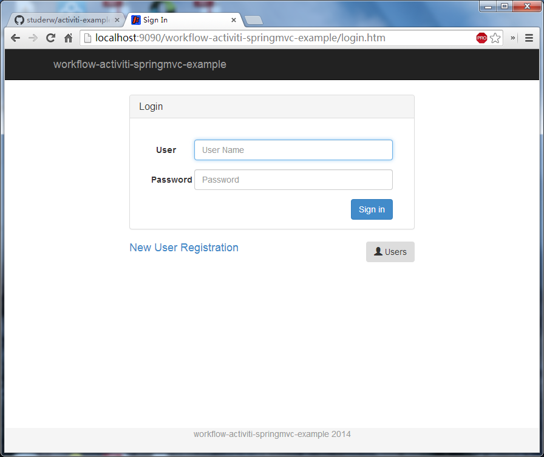
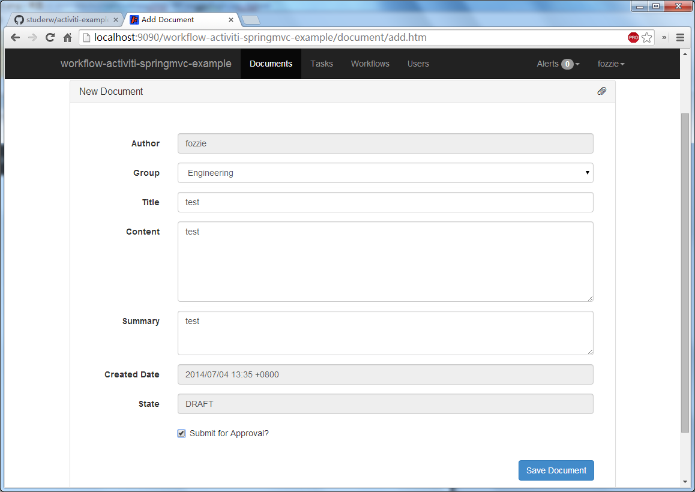
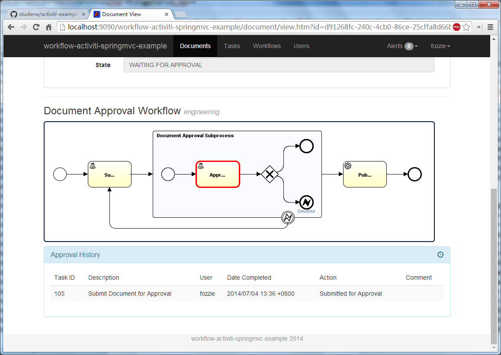
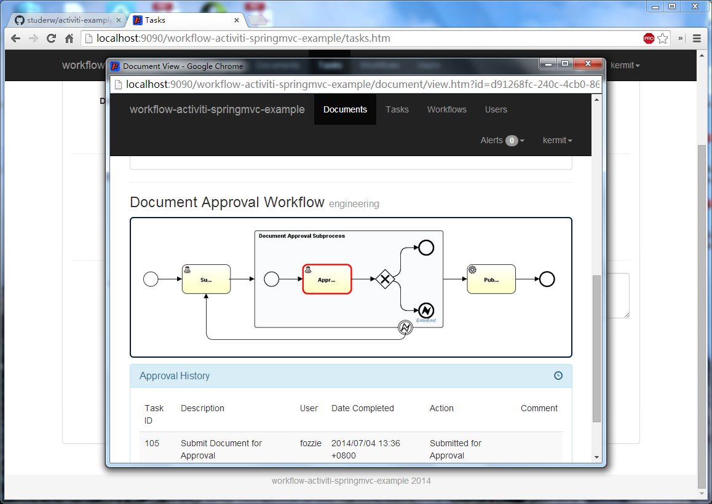
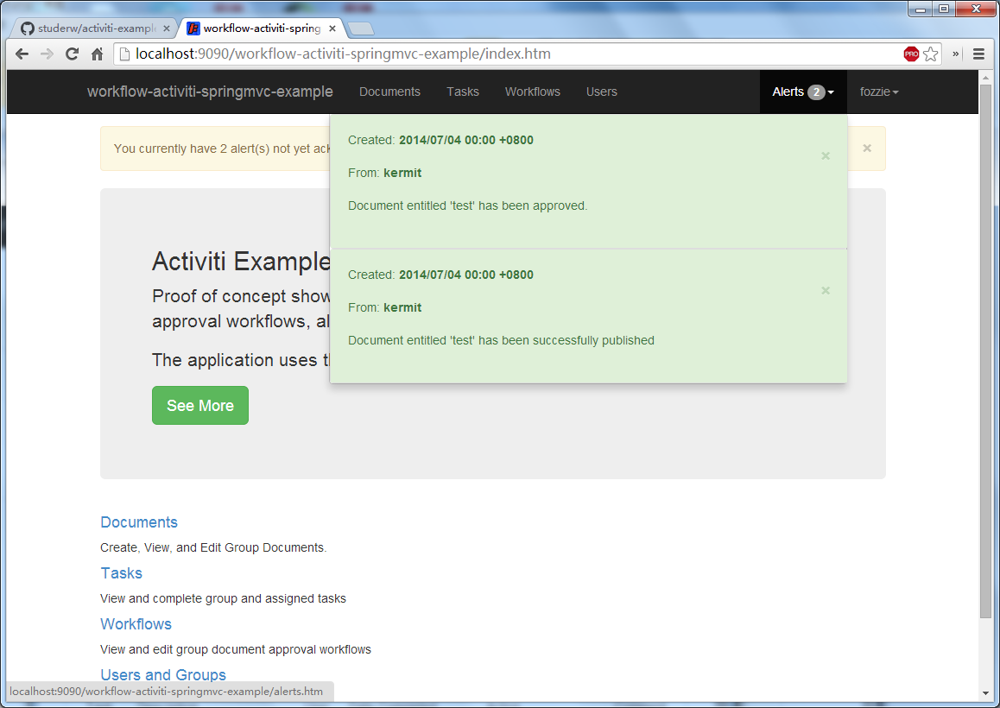

workflow-activiti-springmvc-example
================

Activiti Workflow example using Spring MVC 、 Spring Security

```
mvn tomcat7:run
```

[http://localhost:9090/workflow-activiti-springmvc-example/](http://localhost:9090/workflow-activiti-springmvc-example/)

登录



发布流程



查看流程节点



流程办理及查看流程节点



通知提醒



参考来源

[https://github.com/studerw/activiti-example](https://github.com/studerw/activiti-example)